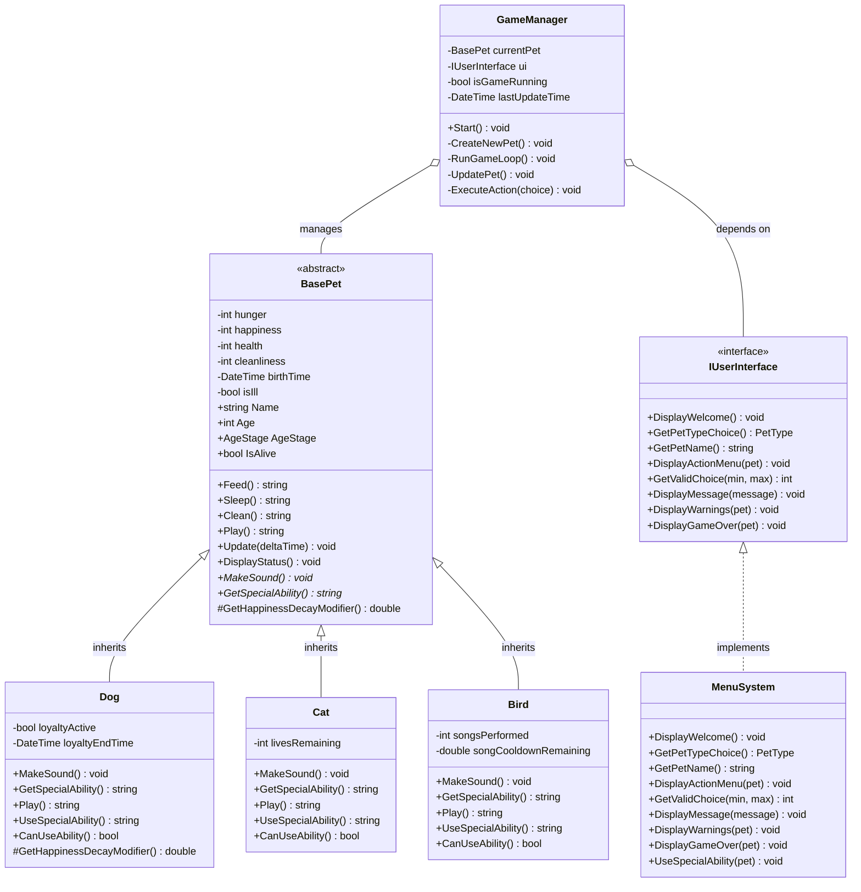

# Virtual Pet Simulator

A console-based virtual pet simulator game implemented in both **C#** and **Go**, demonstrating object-oriented programming principles and design patterns. Take care of your virtual pet (Dog, Cat, or Bird) by feeding, playing, cleaning, and using their unique special abilities!

## Table of Contents
- [Description](#description)
- [Features](#features)
- [Project Structure](#project-structure)
- [How to Run](#how-to-run)
  - [C# Version](#c-version)
  - [Go Version](#go-version)
- [How to Run Tests](#how-to-run-tests)
  - [C# Tests](#c-tests)
  - [Go Tests](#go-tests)
- [Program Architecture](#program-architecture)
  - [Class Diagram](#class-diagram)
  - [Game Flow Diagram](#game-flow-diagram)
- [Game Mechanics](#game-mechanics)
- [OOP Principles Demonstrated](#oop-principles-demonstrated)
- [References](#references)

## Description

Virtual Pet Simulator is an interactive console application where you adopt and care for a virtual pet. Choose between three pet types (Dog, Cat, or Bird), each with unique characteristics and special abilities. The game features:

- **Real-time stat degradation** based on elapsed time
- **Age-based mechanics** (Baby, Adult, Elderly stages)
- **Illness system** triggered by poor cleanliness
- **Special abilities** unique to each pet type
- **Interactive menu-based gameplay**

The project is implemented in two programming languages to demonstrate language-agnostic design principles and provide a comparative learning experience.

## Features

### Pet Types and Special Abilities

1. **Dog**
   - Special Ability: **Loyalty** - Reduces happiness decay for 60 seconds
   - Behavior: Extra happiness from playing, very energetic

2. **Cat**
   - Special Ability: **Nine Lives** - Auto-revives on death (up to 9 lives)
   - Behavior: Independent play style, conserves energy

3. **Bird**
   - Special Ability: **Song** - Boosts all stats when singing (2-minute cooldown)
   - Behavior: Balanced stats, aerial acrobatics

### Core Mechanics

- **Dynamic Stats**: Health, Hunger, Happiness, Cleanliness (0-100)
- **Time-based Decay**: Stats decrease over time based on pet age
- **Illness System**: Pets can get sick if cleanliness is too low
- **Age Stages**: Baby (0-5 min), Adult (5-15 min), Elderly (15+ min)
- **Interactive Actions**: Feed, Play, Sleep, Clean, Interact, Use Special Ability

## Project Structure

### C# Implementation (`VirtualPetC#/`)
```
VirtualPetC#/
├── VirtualPetC#/
│   ├── Core/
│   │   ├── Pets/
│   │   │   ├── BasePet.cs         # Abstract base class
│   │   │   ├── Dog.cs             # Dog implementation
│   │   │   ├── Cat.cs             # Cat implementation
│   │   │   └── Bird.cs            # Bird implementation
│   │   └── GameManager.cs         # Game orchestration
│   ├── UI/
│   │   ├── IUserInterface.cs      # UI abstraction
│   │   └── MenuSystem.cs          # Console UI implementation
│   ├── Enums/
│   │   └── PetEnums.cs            # Age stages and pet types
│   └── Program.cs                 # Entry point
└── VirtualPetTests/
    ├── PetTests.cs                # Base pet tests
    ├── DogTests.cs                # Dog-specific tests
    ├── CatTests.cs                # Cat-specific tests
    ├── BirdTests.cs               # Bird-specific tests
    └── IllnessTests.cs            # Illness mechanic tests
```

### Go Implementation (`VirtualPetGo/`)
```
VirtualPetGo/
├── pet/
│   ├── pet.go                     # Pet interface
│   ├── base_pet.go                # Base pet implementation
│   ├── dog.go                     # Dog implementation
│   ├── cat.go                     # Cat implementation
│   ├── bird.go                    # Bird implementation
│   └── *_test.go                  # Test files
├── game/
│   └── game_manager.go            # Game orchestration
├── ui/
│   └── ui.go                      # Console UI
├── utils/
│   └── input.go                   # Input utilities
└── main.go                        # Entry point
```

## How to Run

### C# Version

**Prerequisites:**
- .NET 8.0 SDK or higher

**Steps:**
1. Navigate to the C# project directory:
   ```bash
   cd VirtualPetC#/VirtualPetC#
   ```

2. Run the application:
   ```bash
   dotnet run
   ```
### Go Version

**Prerequisites:**
- Go 1.25 or higher

**Steps:**
1. Navigate to the Go project directory:
   ```bash
   cd VirtualPetGo
   ```

2. Install dependencies:
   ```bash
   go mod download
   ```

3. Run the application:
   ```bash
   go run main.go
   ```

**Alternative (build executable):**
```bash
go build -o VirtualPetGo.exe
./VirtualPetGo.exe
```


## Class Diagram

The following diagram illustrates the object-oriented design of the Virtual Pet Simulator:



## Game Mechanics

### Stat Decay Rates
- **Hunger**: 2.0 points/second (before multipliers)
- **Cleanliness**: 1.5 points/second
- **Happiness**: 1.0 points/second (only when hunger or cleanliness < 30)
- **Health**: 0.5 points/second (when 2+ stats are critically low OR when ill)

### Age-Based Multipliers
- **Baby (0-5 min)**: 1.3x decay rate (learns quickly, needs more care)
- **Adult (5-15 min)**: 1.0x decay rate (stable)
- **Elderly (15+ min)**: 0.7x decay rate (slowed metabolism)

### Illness System
- **Trigger**: Low cleanliness increases illness chance
  - Cleanliness < 30: 7.5% chance every 5 seconds
  - Cleanliness < 10: 17.5% chance every 5 seconds
- **Effect**: 2.5x health decay multiplier
- **Cure**: Clean the pet (raises cleanliness above threshold)

## OOP Principles Demonstrated

### 1. Abstraction
- `BasePet` abstract class defines common pet behavior
- Abstract methods `MakeSound()` and `GetSpecialAbility()` must be implemented by subclasses

### 2. Inheritance
- `Dog`, `Cat`, and `Bird` inherit from `BasePet`
- Shared functionality (Feed, Sleep, Clean) inherited from base class

### 3. Polymorphism
- Different implementations of `MakeSound()`, `Play()`, and special abilities
- Runtime polymorphism: `BasePet` reference can hold any pet type

### 4. Encapsulation
- Private fields with controlled access via properties
- Stat values clamped between 0-100 internally
- Protected methods for subclass-specific behavior
## Other Used Principles
### Dependency Inversion Principle
- `GameManager` depends on `IUserInterface` interface, not concrete `MenuSystem`
- Allows swapping UI implementations without changing game logic

### Template Method Pattern
- `Update()` method in `BasePet` provides algorithm structure
- Subclasses override hooks like `GetHappinessDecayModifier()` to customize behavior

## References

### Documentation & Tutorials
- [.NET Documentation](https://docs.microsoft.com/en-us/dotnet/) - Official C# and .NET documentation
- [Go Documentation](https://golang.org/doc/) - Official Go programming language documentation
- [xUnit Testing Framework](https://xunit.net/) - Unit testing framework for C#
- [Go Testing Package](https://pkg.go.dev/testing) - Standard Go testing documentation

### Design Patterns & Best Practices
- [SOLID Principles](https://en.wikipedia.org/wiki/SOLID) - Object-oriented design principles
- [Dependency Inversion Principle](https://en.wikipedia.org/wiki/Dependency_inversion_principle) - Used in GameManager design
- [Template Method Pattern](https://refactoring.guru/design-patterns/template-method) - Used in BasePet.Update()

### Language-Specific Resources
- [C# Abstract Classes](https://docs.microsoft.com/en-us/dotnet/csharp/programming-guide/classes-and-structs/abstract-and-sealed-classes-and-class-members)
- [C# Interfaces](https://docs.microsoft.com/en-us/dotnet/csharp/programming-guide/interfaces/)
- [Go Interfaces](https://go.dev/tour/methods/9)
- [Go Embedding](https://golang.org/doc/effective_go#embedding) - Used for composition-based inheritance

### Console UI Libraries
- [Simplifying Your Terminal Experience with Go: Clearing the Screen](https://dev.to/muhammadsaim/simplifying-your-terminal-experience-with-go-clearing-the-screen-1p7f) - Screen clearing utility for Go

---

**Developed as a semester project demonstrating OOP principles and cross-language implementation.**
